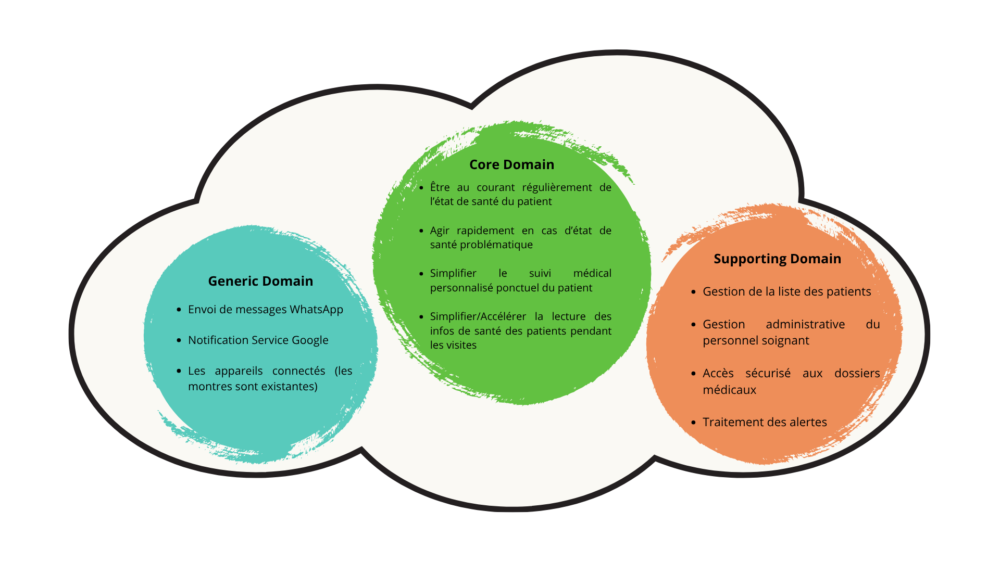

# Projet IAL – Suivi et maintient de personne à domicile

## Composition de l'Équipe

- [**Emma ALLAIN**](https://github.com/emmaallain)
- [**Roxane BACON**](https://github.com/RoxaneBacon)
- [**Antoine FADDA RODRIGUEZ**](https://github.com/Antoine-FdRg)
- [**Baptiste LACROIX**](https://github.com/BaptisteLacroix)
- [**Théo VIDAL**](https://github.com/Dalvii)

## Description du sujet

Le projet IAL a pour objectif de concevoir un système de suivi de santé à domicile pour les personnes âgées.  
Ce système s’appuie sur une station connectée associée à différents dispositifs médicaux (montre, balance, etc.) permettant de mesurer plusieurs paramètres physiologiques :

- Poids
- Pouls
- Température corporelle
- Nombre de pas

Les données sont ensuite transmises automatiquement aux différents acteurs concernés :

- Les **médecins**, pour le suivi médical et la détection d’anomalies.
- Les **infirmiers**, pour la planification des visites.
- Les **proches**, pour être rassurés via un résumé hebdomadaire.
- L’**administrateur**, pour la supervision technique et la maintenance du système.

## Décisions initiales

### Client

Le médecin est considéré comme le client principal, proposant la solution aux proches de la personne âgée.

### Installation

- Les stations et les dispositifs sont configurés par un administrateur.
- Un prestataire se charge de l’installation du matériel chez la personne âgée.

### Mises à jour

Le système est conçu pour être auto-hébergé, avec un backend pouvant tourner sur Kubernetes.  
Les stations disposent d’un mécanisme de mise à jour automatique sécurisé :

1. Un script vérifie régulièrement la version installée.
2. La station télécharge la mise à jour depuis un serveur HTTPS.
3. Vérification de la signature et de l’intégrité du binaire.
4. Installation sur une partition secondaire (avec backup).
5. Rollback automatique en cas d’échec au démarrage.


## Liste des fonctionnalités principales

### Personnes âgées

- Station centrale connectée à Internet.
- Balance et bracelet connectés à la station.
- Capteurs mesurant :
  - le pouls,
  - la température corporelle,
  - le poids,
  - le nombre de pas / activité physique.

### Infirmiers

- Web app affichant les données agrégées des patients.
- Consultation des mesures lors des visites ponctuelles à domicile.

### Docteurs

- Accès à des rapports analytiques détaillés.
- Alertes automatiques en cas de valeurs anormales.
- Possibilité d’ordonner une visite exceptionnelle à un infirmier.

### Proches

- Notifications WhatsApp hebdomadaires sur l’état général du proche :
  - ☀️ Tout va bien
  - ☁️ Quelques difficultés
  - 🧑‍🦼 Faible activité

### Administrateur

- Supervision des instances et objets IoT.
- Création / modification des instances de déploiement (stack complète par région).
- Déploiement des mises à jour globales (backend et stations).


## User Stories

### 🟣 Epic 1 : Assistance et sécurité des personnes âgées

> En tant que **personne âgée**,  
> je veux être suivie sur mon état de santé (pouls, poids, pas, etc.) **sans effort particulier**,  
> afin que mes proches et soignants puissent **suivre mon évolution.**


### 🔵 Epic 2 : Suivi médical par les soignants

> En tant qu’**infirmier ou médecin**,
> je veux accéder aux **données de santé de mes patients de manière claire et synthétique** via une interface claire, remontant les signaux et évènements importants
> afin de **mieux préparer mes visites **

> En tant que **médecin**,
> je veux pouvoir **consulter les données de santé détaillées** à plus ou moins longs termes de mes patients
> afin de **disposer d’une vision complète** lors des rendez-vous médicaux et de les interpréter moi-même

> En tant que **médecin**
> je veux **recevoir une notification en cas d’anomalie de santé** afin de **décider rapidement après analyse si je dois ordonner une visite infirmière**.

> En tant que **médecin**
> je veux pouvoir **remplir le dossier du patient** à l’aide d’un formulaire
> afin d’**initialiser ses informations personnelles** lors de son inscription


### 🟢 Epic 3 : Communication avec les proches

> En tant que **proche**,  
> je veux recevoir **un récapitulatif hebdomadaire** de l’état de santé général,  
> afin d’être **rassuré et informé** de l’évolution de mon proche.


### 🟠 Epic 4 : Supervision et administration

> En tant qu’**administrateur**,
> je veux pouvoir créer des utilisateurs et relier leurs objets connectés au système en entrant un identifiant unique (utilisé dans le nom du topic de communication) dans la station et les objets
> afin de facilement intégrer des nouveaux clients.

> En tant qu’**administrateur**,
> je veux pouvoir **surveiller l’état du système et des appareils connectés** tel que la date de dernière connexion, la version software installée pour chaque station/devices, et le dernier rapport de la station
> afin de **détecter rapidement tout problème** de fonctionnement.

> En tant qu’**administrateur**,
> je veux pouvoir **créer le dossier du patient** à remplir par le médecin
> afin de **détecter rapidement tout problème de fonctionnement.**

> En tant qu’**administrateur**,
> je veux pouvoir **déployer des mises à jours** sur le système global (backend via kubernetes, station via leur script d’update)
> afin de **garantir la mise à jour des systèmes et leur sécurité**


## Découpage en domaines (DDD)



### **Core Domain**

> Domaine médical – cœur de la valeur métier

- Être au courant régulièrement de l’état de santé du patient
- Agir rapidement en cas d’état de santé problématique
- Simplifier le suivi médical personnalisé ponctuel d’un patient
- Simplifier/Accélérer la lecture des infos de santé des patients pendant les visites


### **Supportive Domain**

> Fonctionnalités de support au cœur métier

- Gestion de la liste des patients
- Gestion administrative du personnel soignant
- Accès sécurisé aux dossiers médicaux
- Traitement des alertes


### **Generic Domain**

> Éléments techniques réutilisables

- Envoi de messages WhatsApp
- Notification Service Google
- Les appareils connectés (les montres sont existantes)

## Contraintes techniques

- Système scalable à l’échelle nationale (≈ 20 000 patients par région).
- Une station = un patient (relation fixe).
- Les objets connectés actuels ne sont pas évolutifs (pas de mise à jour firmware).
- Intégration exclusive de nos propres appareils.


## Bases de données

En savoir plus sur la measurementDB : [+ info](./databases/measurement-db/README.md)

En savoir plus sur la userDB : [+ info](./databases/user-db/README.md)

## Sécurité

### Authentification Save Service

Le save-service utilise des tokens Bearer pour authentifier les boitiers :

- Tokens stockés en SHA-256 dans la table `boxes`
- Header requis : `Authorization: Bearer <token>`
- Tokens de test : `box1-secret-token`, `box2-secret-token`

#### Exemple de génération de certificats

- Créer une clé privée CA

```shell
openssl genrsa -out ca.key 4096
```

- Créer un certificat CA auto-signé

```shell
openssl req -x509 -new -nodes -key ca.key -sha256 -days 3650 -out ca.pem -subj "/CN=MyNatsCA"
```

- Créer une clé serveur

```shell
openssl genrsa -out server.key 2048
```

- CSR (demande de signature) selon le hostname du broker

```shell
openssl req -new -key server.key -out server.csr -subj "/CN=nats\-broker"
```

- Signer le certificat serveur avec la CA

```shell
openssl x509 -req -in server.csr -CA ca.pem -CAkey ca.key -CAcreateserial -out server.crt -days 365 -sha256
```

Le serveur requiert `server.crt` et `server.key` pour démarrer en TLS. Le client requiert `ca.pem` pour vérifier l'identité du broker lorsqu'il s'y connecte

## Analyse des risques

Une étude approfondie des risques a été établie tout au long du projet: [consulter l'analyse des risques](./doc/RISQUES.md)

## Utilisation du cloud

Retrouvez plus d'informations sur les services cloud [juste ici](./doc/CLOUD.md)

## Démonstration

Dans le cadre du POC présenté en séance, certaines adaptations ont été apportées pour des raisons de temps et de contraintes matérielles tout en gardant l'aspect fonctionnel du projet :

- Les appareils physiques (comme les montres connectées) ont été simulés via une API REST. Cette API envoie des données en conditions proches du réel, telles que le pouls, le poids, le nombre de pas et la température, tout en intégrant volontairement divers types d’erreurs (valeurs incohérentes, unités incorrectes, messages malformés) pour tester par la suite notre pipeline et la robustesse de nos systèmes.

- Le serveur de communication Bluetooth prévu initialement a été remplacé par un serveur REST, facilitant les échanges et la démo sans dépendance matérielle.
- Dans la version de démonstration, la notification de l’état de santé d’un patient à ses proches ne passe pas par WhatsApp comme spécifié à l’origine, mais par Discord.

## Conclusion

Le projet IAL vise à proposer une solution intégrée, sécurisée et évolutive pour le suivi des personnes âgées à domicile.  
En combinant IoT, cloud, et supervision médicale, l’objectif est de réduire les déplacements inutiles, anticiper les situations critiques et simplifier la collaboration entre médecins, infirmiers et proches.

## Contribution globale de l'équipe

| Nom             | Prenom   | Description des missions principales                                                                                                      |
| --------------- | -------- | ----------------------------------------------------------------------------------------------------------------------------------------- |
| ALLAIN          | Emma     | Analyse de risques (matrices & bowties), client Nats du boitier, implémentation de la db et de la communication BLE/GATT de l'IoT gateway |
| BACON           | Roxane   | Analyse de risques (matrices & bowties), réflexion et implémentation de la userDB, documentation et illustration du sujet                 |
| FADDA RODRIGUEZ | Antoine  | Implémentation de la pipeline, documentation, client Nats du boitier                                                                      |
| LACROIX         | Baptiste | Implémentation de la pipeline et de l'uploader dans la measurementDB                                                                      |
| VIDAL           | Théo     | Implémentation de la measurementDB, du système de notifications aux proches, et de la pipeline                                            |
