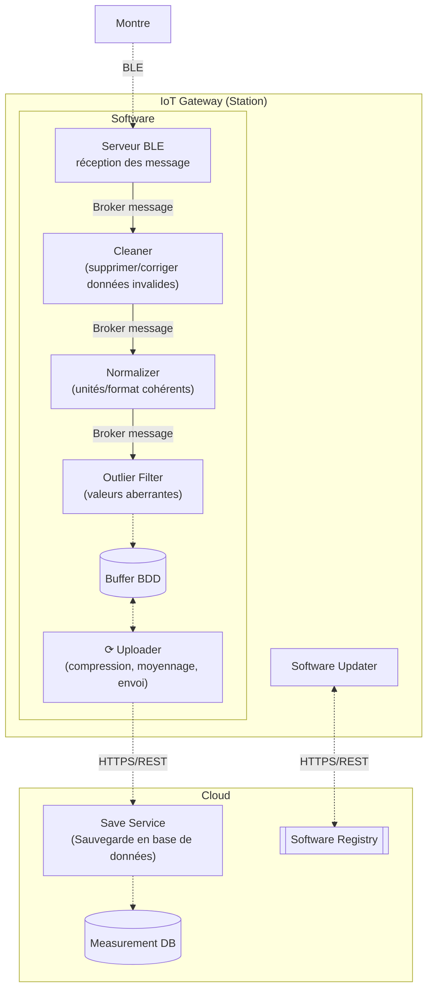
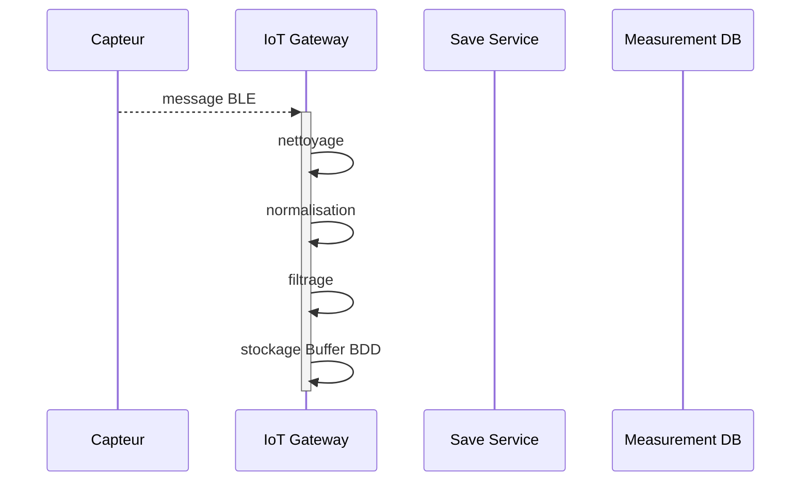
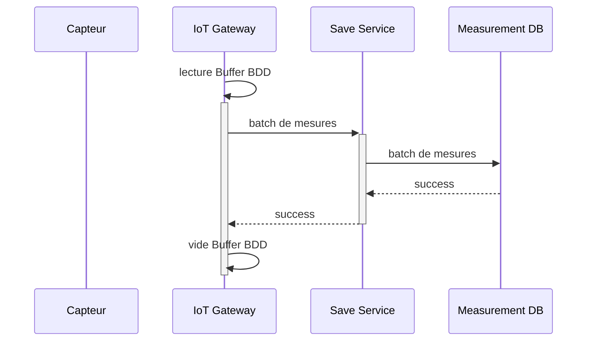

# IoT Gateway - Station
La Station est l'IoT gateway, une pièce obligatoire du système, le seul appareil que tous les utilisateurs doivent posséder car il recueille les données des capteurs via des message Bluetooth Low Energy GATT, les traites localement, les sauvegarde localement, avant les envoyer dans le cloud toutes les 30 minutes. C'est la edge layer de notre système.

[En savoir plus](https://www.notion.so/Diagramme-composants-Data-Pipeline-280b70b82f6b80f48968cb4c271ec0b5)

## Analyse des risques

### 1. Perte de données
Pour palier à d'éventuelles pertes de connexion internet ou pannes de courant, le broker de messages NATS est configuré pour persister les messages entre les services de la pipeline d'ingestion. De plus, une base de données locale (Buffer BDD) est utilisée pour stocker temporairement les données avant leur envoi au cloud. Ainsi, en cas d'interruption, les données sont conservées localement et envoyées dès que la connexion est rétablie.

### 2. Retard de données
Pour prévenir les retards de données, en cas de pannes réseaux, un système de tentative de connexion régulière est mis en place pour rétablir la communication dès que possible et assurer un upload le plus rapide possible.

Si jamais des données sont reçues en retard dans le cloud, elles seront tout de même traitées, sauvegardées et intégrées dans l'analyse suivante.

### 3. Perte de privacité
Toutes les communications entre la Station et le cloud sont chiffrées via HTTPS pour garantir la confidentialité des données transmises. 

### 4. Prise d'otage des données
De la même manière, toutes les communications entre la Station et le cloud sont chiffrées via HTTPS pour garantir la confidentialité des données transmises, et éviter toute interception malveillante.

Si malgré cela des mesures sont victimes d'un ransomware, elles seront rachetées pour garantir la privacité des données.

### 5. Réception de fausse donnée
Pour éviter la réception de fausses données, une mécanisme de signature des échanges Bluetooth est mis en place. Chaque message envoyé à la Station est signé numériquement, et la Station vérifie la signature avant de traiter le message. Cela permet de s'assurer que les données proviennent bien d'une source authentique et n'ont pas été altérées en cours de route.

## Fonctionnement général
### Diagramme de séquence de réception d’un message

### Diagramme de séquence d'upload d’un batch de mesure


## Composants logiciels

### Pipeline d'ingestion
Chacun des composants logiciels de la Station est codé en NodeJS car c'est un environnement léger et qui permet un gestion simple des objets, contrairement à java qui aurait été plus lourd à gérer sur une architecture embarquée (à cause de la JVM) et qui est plus verbeux.

La base de données locale (Buffer BDD) est une base MongoDB car elle permet une gestion simple des documents JSON, format natif des messages échangés entre les services de la Station.

- **Serveur BLE**: Composant qui écoute les messages GATT envoyés par les capteurs via Bluetooth Low Energy (BLE) et les transmet au Cleaner pour traitement ultérieur.
- **Cleaner**: Service qui reçoit les messages du Serveur BLE et supprime ou corrige les données invalides avant de les transmettre au Normalizer.
- **Normalizer**: Service qui standardise les unités et formats des données reçues du Cleaner, assurant ainsi une cohérence avant de les envoyer au Outlier Filter.
- **Outlier Filter**: Composant qui analyse les données normalisées pour détecter et gérer les valeurs aberrantes, garantissant ainsi la qualité des données stockées.
- **Buffer BDD**: Base de données locale qui stocke temporairement les données traitées avant leur envoi au cloud.
- **Uploader**: Service responsable de la compression, du moyennage et de l'envoi des données stockées dans le Buffer BDD vers le Save Service dans le cloud via HTTPS/REST.

#### Broker NATS
Le broker NATS est utilisé pour faire transiter les messages entre les différents services de la pipeline d'ingestion de la Station. Il est configuré grâce à une application NodeJS qui met en place la persistance des messages via JetStream. NATS a été choisi pour son extrême légèreté et sa persistance intégrée. NATS est donc plus léger que des solutions comme RabbitMQ ou Kafka, ce qui est un avantage pour une architecture embarquée. De plus, contrairement à MQTT, NATS intègre nativement un système de persistance des messages via JetStream, ce qui évite d'avoir à gérer un service supplémentaire pour la persistance.

**Queues utilisées:**
- `MEASUREMENT.to_clean` : Queue entre le Serveur BLE et le Cleaner.
- `CLEAN.to_normalize` : Queue entre le Cleaner et le Normalizer.
- `NORMALIZE.to_outlier` : Queue entre le Normalizer et le Outlier Filter.

### Software Updater
Le Software Updater est un service qui vérifie quotidiennement la présence de nouvelles versions du logiciel de la Station dans le Software Registry du cloud. Si une nouvelle version est disponible, il télécharge l'image docker correspondante et met à jour le composant concerné. Il peut, en cas d'erreur, revenir à la version précédente pour assurer la continuité du service.
Il sera codé en Shell et lancé par une tâche cron quotidienne.

### Données échangées

#### Serveur BLE -> Cleaner

Queue : MEASUREMENT.to_clean

```json
{
    "type" : string
    "value" : number,
    "unit" : string,
    "timestamp": string
}
```
```

#### Cleaner -> Normalizer

Queue : MEASUREMENT.to_normalize

```json
{
    "type" : string
    "value" : number,
    "unit" : string,
    "timestamp": string
}
```

#### Normalizer -> Outlier filter

Queue : MEASUREMENT.to_outlierfilter

```json
{
    "type" : string
    "value" : number,
    "unit" : string,
    "timestamp": string
}
```
#### Outlier filter -> Buffer BDD

```json
{
    "type" : string
    "value" : number,
    "unit" : string,
    "timestamp": string
}
```

#### Uploader -> Save Service
Via appel REST HTTPS : POST /measurements

```json
{
  "boxId": string,
  "dataList": [
        {
            "type" : string,
            "value" : number,
            "unit" : string,
            "timestamp": string
        },
        ...
    ]
}
```