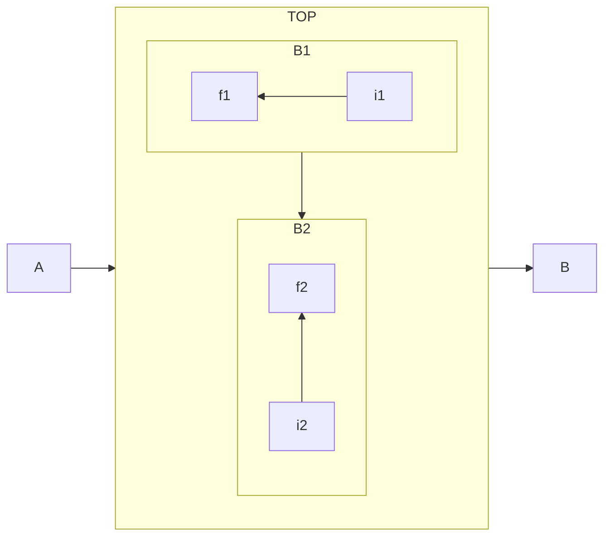

# Broker NATS
NATS est un middleware orienté messages léger et performant. Il est utilisé dans cette architecture pour faire transiter les messages entre les différents services la pipeline d'ingestion.

## Configuration
Le broker NATS est configuré en 2 étapes :
- l'application NodeJS qui met en place la persistance des messages
- le fichier de configuration passé au container (uniquement en version *production*)

### Application NodeJS
L'application est chargé d'initialiser les streams NATS. Un stream permet de persister les messages échangés sur un sujet donné. [Voir la doc officielle](https://docs.nats.io/nats-concepts/jetstream/streams)

### Fichier de configuration NATS (production)
Le fichier de configuration est passé au container NATS via un volume docker. De cette manière la configuration n'est pas stcokée dans l'image docker. Deux sécurisations sont mises en place : TLS et NKEYS.

#### NKeys
permet d'authentifier les clients auprès du broker NATS via une paire de clés publique/privée.

*Prérequis : installer Go*

**Génerer un couple de NKey**

``` shell
nk -gen user -pubout
```

#### TLS 
permet de chiffrer les échanges entre les clients et le broker NATS. Un certificat serveur est utilisé pour authentifier le broker auprès des clients.
##### Exemple de génération de certificats

- Créer une clé privée CA
``` shell
openssl genrsa -out ca.key 4096
``` 

- Créer un certificat CA auto-signé
``` shell
openssl req -x509 -new -nodes -key ca.key -sha256 -days 3650 -out ca.pem -subj "/CN=MyNatsCA"
```

- Créer une clé serveur
``` shell
openssl genrsa -out server.key 2048
```

- CSR (demande de signature) selon le hostname du broker
```shell
openssl req -new -key server.key -out server.csr -subj "/CN=nats\-broker"
```

- Signer le certificat serveur avec la CA
```shell
openssl x509 -req -in server.csr -CA ca.pem -CAkey ca.key -CAcreateserial -out server.crt -days 365 -sha256
```
- Le broker requiert `server.crt` et `server.key` pour démarrer en TLS. Le client NATS requiert `ca.pem` pour vérifier l'identité du broker lorsqu'il s'y connecte

