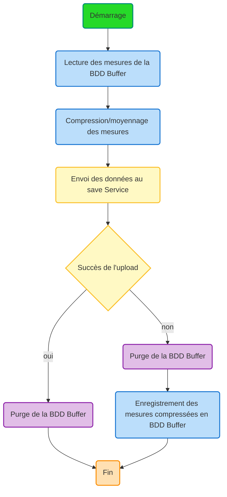

# Service Uploader

## Aperçu

Le service Uploader est un microservice basé sur TypeScript qui traite les données de mesures de santé depuis une base de données buffer MongoDB, les compresse en moyennant les valeurs par type de mesure, et upload les données compressées vers un service de sauvegarde.

## Architecture

Le service suit un pattern d'architecture propre avec le workflow suivant :



### Fonctionnement

1. **Démarrage** : Connexion à la base de données buffer MongoDB
2. **Récupération des données** : Lecture de toutes les mesures depuis la base de données buffer
3. **Compression** : Regroupement des mesures par type et calcul des moyennes
4. **Tentative d'upload** : Envoi des données compressées vers le service de sauvegarde avec authentification par UUID de la station
5. **Chemin de succès** : Purge de la base de données buffer
6. **Chemin d'échec** : Purge des données originales, stockage des données compressées pour un nouvel essai
7. **Arrêt** : Gestion propre de la déconnexion sur les signaux SIGINT/SIGTERM

## Installation

1. Installer les dépendances :
```bash
npm install
```

2. Configurer les variables d'environnement (copier `.env.example` vers `.env` et configurer) :
```bash
cp .env.example .env
# Éditer .env avec votre configuration
```

3. Construire le projet :
```bash
npm run build
```

## Fonctionnalités

- **Compression de données** : Regroupe les mesures par type (température, pouls, poids, pas) et calcule les valeurs moyennes
- **Upload résilient** : Gère les échecs du service de sauvegarde en stockant les données compressées localement
- **Authentification** : Utilise l'UUID de la box pour l'authentification du service
- **Intégration MongoDB** : Lit et gère une base de données buffer MongoDB
- **Gestion d'erreurs** : Gestion d'erreurs complète avec logging horodaté
- **Arrêt propre** : Gère les signaux SIGINT et SIGTERM correctement

## Types de données

### RawMeasurement
```typescript
type RawMeasurement = {
    type: 'temperature' | 'pulse' | 'weight' | 'steps';
    value: number;
    unit: string;
    timestamp: string;
};
```

### MeasurementListDTO
```typescript
type MeasurementListDTO = {
    boxId: string;
    dataList: RawMeasurement[];
}
```

## Services

### DatabaseService
Gère les connexions et opérations MongoDB :
- `connect()` : Établit la connexion à la base de données
- `disconnect()` : Ferme la connexion à la base de données
- `getAllMeasurementsCollection()` : Récupère toutes les mesures depuis le buffer
- `removeAllMeasurementsCollection()` : Efface toutes les mesures du buffer
- `saveCompressedMeasurements()` : Stocke les mesures compressées dans le buffer

### CompressionService
Gère la logique de compression des données :
- `compressMeasurements()` : Regroupe les mesures par type et calcule les moyennes
- Regroupe les mesures par type (température, pouls, poids, pas)
- Calcule les valeurs moyennes pour chaque type de mesure
- Préserve les informations d'unité et utilise le timestamp le plus ancien

### SaveServiceClient
Gère la communication avec le service de sauvegarde :
- `sendCompressedMeasurements()` : Envoie les données compressées au service de sauvegarde
- Inclut l'authentification par UUID de box
- Retourne le statut de succès/échec pour les décisions de workflow

### EnvService
Gère la configuration d'environnement :
- Paramètres de connexion MongoDB
- Configuration de l'URL du service de sauvegarde
- Gestion de l'UUID de la station pour l'authentification

## Variables d'environnement

### Variables requises

```bash
# Configuration MongoDB
MONGO_HOST=localhost
MONGO_PORT=27017
MONGO_USERNAME=your_mongo_user
MONGO_PASSWORD=your_mongo_password
MONGO_DATABASE=your_database_name

# Configuration du service de sauvegarde
SAVE_SERVICE_URL=http://save-service:3000

# Authentification de la station
BOX_UUID=box-uuid-1
```

## Utilisation

### Développement
```bash
npm start
```

### Production
```bash
npm run build
node dist/main.js
```

### Docker
```bash
# Construire l'image Docker
docker build -t uploader .

# Exécuter avec docker-compose
docker-compose up
```

## Tests

Le projet inclut une couverture de tests complète :

### Tests unitaires
```bash
npm run test:unit
```
Teste les services individuels en isolation avec des dépendances mockées.

### Tests d'intégration
```bash
npm run test:integration
```
Teste l'interaction entre plusieurs services et la logique de workflow.

### Tests E2E
```bash
npm run test:e2e
```
Teste le workflow complet de l'application incluant les interactions avec la base de données et HTTP.

### Tous les tests
```bash
npm test
```

### Couverture de tests
```bash
npm run test:coverage
```

## Intégration API

### Endpoint du service de sauvegarde
```
POST /measurements
Authorization: Bearer {boxId}
Content-Type: application/json

{
    "boxId": "box-uuid",
    "dataList": [
        {
            "type": "temperature",
            "value": 36.75,
            "unit": "°C",
            "timestamp": "2024-01-01T10:00:00Z"
        }
    ]
}
```

## Gestion d'erreurs

- **Échecs de connexion à la base de données** : Le service se ferme avec le code d'erreur 1
- **Échecs du service de sauvegarde** : Les données compressées sont stockées localement pour un nouvel essai
- **Erreurs de compression** : Loggées avec timestamps pour le débogage
- **Erreurs réseau** : Gérées proprement avec stockage de secours

## Logging

Toutes les opérations sont loggées avec des timestamps ISO en français :
- Statut de connexion
- Étapes de traitement des données
- Résultats d'upload
- Conditions d'erreur

Exemple de sortie de log :
```
[2024-01-01T10:00:00.000Z] - Démarrage du workflow d'upload
[2024-01-01T10:00:01.000Z] - Lecture des mesures de la BDD Buffer...
[2024-01-01T10:00:02.000Z] - 150 mesures trouvées
[2024-01-01T10:00:03.000Z] - Compression/moyennage des mesures...
[2024-01-01T10:00:04.000Z] - 150 mesures comprimées en 4 groupes
[2024-01-01T10:00:05.000Z] - Envoi des données au save Service...
[2024-01-01T10:00:06.000Z] - Mesures envoyées avec succès au save service
[2024-01-01T10:00:07.000Z] - Upload réussi - Purge de la BDD Buffer
[2024-01-01T10:00:08.000Z] - Workflow d'upload terminé
```

## Développement

### Structure du projet
```
src/
├── main.ts                 # Point d'entrée de l'application et orchestration du workflow
├── type.ts                 # Définitions de types TypeScript
├── databaseService.ts      # Opérations MongoDB
├── compressionService.ts   # Logique de compression des données
├── saveServiceClient.ts    # Client HTTP pour le service de sauvegarde
└── envService.ts          # Configuration d'environnement

tests/
├── setup.ts               # Configuration des tests
├── unit/                  # Tests unitaires
├── integration/           # Tests d'intégration
└── e2e/                   # Tests end-to-end
```

### Qualité du code
- TypeScript avec vérification stricte des types
- Jest pour les tests avec objectif de couverture 100%
- ESLint et Prettier pour le formatage du code
- Gestion d'erreurs complète
