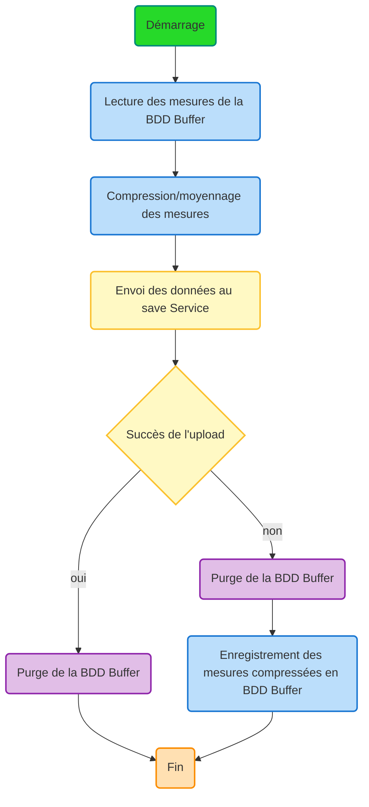

# Uploader Service

## Overview

The Uploader service is a TypeScript-based microservice that processes health measurement data from a MongoDB buffer database, compresses it by averaging values by measurement type, and uploads the compressed data to a save service.

## Architecture

The service follows a clean architecture pattern with the following workflow:



## Features

- **Data Compression**: Groups measurements by type (temperature, pulse, weight, steps) and calculates average values
- **Resilient Upload**: Handles save service failures by storing compressed data locally
- **Authentication**: Uses box UUID for service authentication
- **MongoDB Integration**: Reads from and manages a MongoDB buffer database
- **Error Handling**: Comprehensive error handling with timestamped logging
- **Graceful Shutdown**: Handles SIGINT and SIGTERM signals properly

## Data Types

### RawMeasurement
```typescript
type RawMeasurement = {
    type: 'temperature' | 'pulse' | 'weight' | 'steps';
    value: number;
    unit: string;
    timestamp: string;
};
```

### MeasurementListDTO
```typescript
type MeasurementListDTO = {
    boxId: string;
    dataList: RawMeasurement[];
}
```

## Services

### DatabaseService
Manages MongoDB connections and operations:
- `connect()`: Establishes database connection
- `disconnect()`: Closes database connection
- `getAllMeasurementsCollection()`: Retrieves all measurements from buffer
- `removeAllMeasurementsCollection()`: Clears all measurements from buffer
- `saveCompressedMeasurements()`: Stores compressed measurements back to buffer

### CompressionService
Handles data compression logic:
- `compressMeasurements()`: Groups measurements by type and calculates averages
- Groups measurements by type (temperature, pulse, weight, steps)
- Computes average values for each measurement type
- Preserves unit information and uses earliest timestamp

### SaveServiceClient
Manages communication with the save service:
- `sendCompressedMeasurements()`: Sends compressed data to save service
- Includes box UUID authentication
- Returns success/failure status for workflow decisions

### EnvService
Manages environment configuration:
- MongoDB connection parameters
- Save service URL configuration
- Box UUID management (randomly selects between BOX_1_UUID and BOX_2_UUID)

## Environment Variables

### Required Variables

```bash
# MongoDB Configuration
MONGO_HOST=localhost
MONGO_PORT=27017
MONGO_USERNAME=your_mongo_user
MONGO_PASSWORD=your_mongo_password
MONGO_DATABASE=your_database_name

# Save Service Configuration
SAVE_SERVICE_URL=http://save-service:3000

# Box Authentication
BOX_1_UUID=box-uuid-1
BOX_2_UUID=box-uuid-2
```

## Installation

1. Install dependencies:
```bash
npm install
```

2. Set up environment variables (copy `.env.example` to `.env` and configure):
```bash
cp .env.example .env
# Edit .env with your configuration
```

3. Build the project:
```bash
npm run build
```

## Usage

### Development
```bash
npm start
```

### Production
```bash
npm run build
node dist/main.js
```

### Docker
```bash
# Build Docker image
docker build -t uploader .

# Run with docker-compose
docker-compose up
```

## Testing

The project includes comprehensive test coverage:

### Unit Tests
```bash
npm run test:unit
```
Tests individual services in isolation with mocked dependencies.

### Integration Tests
```bash
npm run test:integration
```
Tests interaction between multiple services and workflow logic.

### E2E Tests
```bash
npm run test:e2e
```
Tests complete application workflow including database and HTTP interactions.

### All Tests
```bash
npm test
```

### Test Coverage
```bash
npm run test:coverage
```

## Workflow Logic

1. **Startup**: Connect to MongoDB buffer database
2. **Data Retrieval**: Read all measurements from buffer database
3. **Compression**: Group measurements by type and calculate averages
4. **Upload Attempt**: Send compressed data to save service with box authentication
5. **Success Path**: Clear buffer database
6. **Failure Path**: Clear original data, store compressed data for retry
7. **Shutdown**: Handle graceful disconnection on SIGINT/SIGTERM

## API Integration

### Save Service Endpoint
```
POST /measurements
Authorization: Bearer {boxId}
Content-Type: application/json

{
    "boxId": "box-uuid",
    "dataList": [
        {
            "type": "temperature",
            "value": 36.75,
            "unit": "°C",
            "timestamp": "2024-01-01T10:00:00Z"
        }
    ]
}
```

## Error Handling

- **Database Connection Failures**: Service exits with error code 1
- **Save Service Failures**: Compressed data stored locally for retry
- **Compression Errors**: Logged with timestamps for debugging
- **Network Errors**: Gracefully handled with fallback storage

## Logging

All operations are logged with ISO timestamps in French:
- Connection status
- Data processing steps
- Upload results
- Error conditions

Example log output:
```
[2024-01-01T10:00:00.000Z] - Démarrage du workflow d'upload
[2024-01-01T10:00:01.000Z] - Lecture des mesures de la BDD Buffer...
[2024-01-01T10:00:02.000Z] - 150 mesures trouvées
[2024-01-01T10:00:03.000Z] - Compression/moyennage des mesures...
[2024-01-01T10:00:04.000Z] - 150 mesures comprimées en 4 groupes
[2024-01-01T10:00:05.000Z] - Envoi des données au save Service...
[2024-01-01T10:00:06.000Z] - Mesures envoyées avec succès au save service
[2024-01-01T10:00:07.000Z] - Upload réussi - Purge de la BDD Buffer
[2024-01-01T10:00:08.000Z] - Workflow d'upload terminé
```

## Development

### Project Structure
```
src/
├── main.ts                 # Application entry point and workflow orchestration
├── type.ts                 # TypeScript type definitions
├── databaseService.ts      # MongoDB operations
├── compressionService.ts   # Data compression logic
├── saveServiceClient.ts    # HTTP client for save service
└── envService.ts          # Environment configuration

tests/
├── setup.ts               # Test configuration
├── unit/                  # Unit tests
├── integration/           # Integration tests
└── e2e/                   # End-to-end tests
```

### Code Quality
- TypeScript with strict type checking
- Jest for testing with 100% coverage goal
- ESLint and Prettier for code formatting
- Comprehensive error handling


