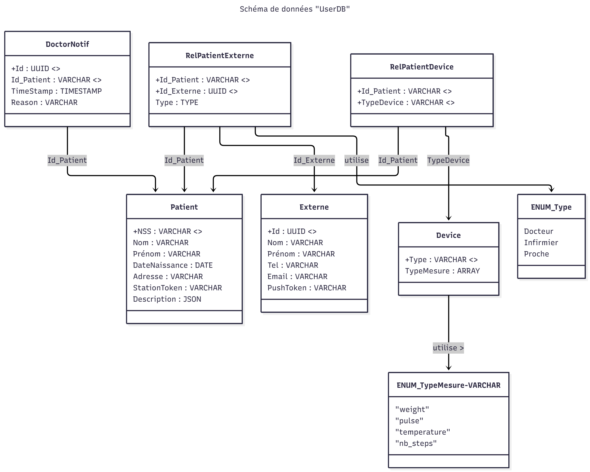

# Base de données
## TimescaleDB
Le projet utilise TimescaleDB (extension PostgreSQL optimisée pour les séries temporelles) pour stocker les mesures.

Configuration dans `databases/measurement-db`:
- Hypertables pour partitionnement automatique par timestamp
- Continuous aggregates pour statistiques pré-calculées
- Retention policy de 90 jours
- Deux tables : `boxes` (authentification) et `measurements` (données)

Démarrer uniquement la base de données :
```bash
cd databases/measurement-db && docker-compose up -d
```

Connexion à la base :
```bash
docker exec -it ial-measurement-db psql -U ial_user -d measurement_db
```

## UserDB

Le schéma de la UserDB a été conçu pour centraliser et organiser l’ensemble des données relatives aux utilisateurs du système, qu’il s’agisse des patients, des professionnels de santé (docteurs, infirmiers) ou des proches.
L’objectif principal est d’assurer une gestion claire des relations entre les différents acteurs, tout en facilitant la traçabilité des dispositifs et des notifications liées à la surveillance des patients.



### Structure générale

Le modèle repose sur cinq entités principales :

- Patient

- Externe

- Device

- DoctorNotif

- Relations (RelPatientExterne, RelPatientDevice)

Deux énumérations (ENUM_Type et ENUM_TypeMesure) permettent de typer les rôles et les mesures associées aux dispositifs.

### 👤  Table Patient

Cette table contient les informations personnelles et médicales d’un patient :

- NSS : Numéro de Sécurité Sociale, identifiant unique du patient (clé primaire).

- Nom, Prénom, DateNaissance, Adresse : informations d’identité et de contact.

- StationToken : identifiant de la station de collecte associée (Iot Gateway).

- Description (JSON) : champ flexible permettant de stocker des informations complémentaires (antécédents, allergies, traitements, etc.).

### 🧑‍⚕️ Table Externe

Cette table regroupe les utilisateurs externes (médecins, infirmiers ou proches) :

- Id : identifiant unique.

- Nom, Prénom, Tel, Email : informations d’identité et de contact.

- PushToken : jeton pour l’envoi de notifications personnalisées.


### Table RelPatientExterne

Cette table assure la relation entre un patient et un utilisateur externe, tout en précisant la nature de la relation entre Id_Patient et Id_Externe

Type : type de lien défini par ENUM_Type (ex. : Docteur, Proche, etc.).

Cela permet à un même patient d’être lié à plusieurs externes, et inversement.

### Table RelPatientDevice

Cette relation relie chaque patient aux dispositifs médicaux qu’il utilise :

- Id_Patient

- TypeDevice : identifiant du dispositif associé (lié à la table Device).

### Table Device

La table Device recense les appareils connectés utilisés pour la surveillance et la maintient à domicile :

- Type : identifiant du dispositif (ex. : balance connectée, montre, bague, etc.).

- TypeMesure : tableau de mesures collectées par ce dispositif, basé sur ENUM_TypeMesure :

    - "weight"

    - "pulse"

    - "temperature"

    - "nb_steps"

### Table DoctorNotif

Cette table gère les notifications automatiques envoyées au médecin en cas d'anomalie detectée :

- Id : identifiant unique de la notification.

- Id_Patient : patient concerné.

- TimeStamp : date et heure d’émission.

- Reason : motif ou contenu du message.


### Logique globale

L’ensemble du modèle permet :

- Une gestion centralisée des utilisateurs (patients, professionnels, proches).

- Une traçabilité complète des dispositifs utilisés et des données collectées.

- Une communication fluide entre les acteurs grâce aux notifications et aux relations typées.

- Une évolutivité grâce à l’utilisation de champs flexibles (JSON, ARRAY) et d’énumérations pour garantir la cohérence des types.
