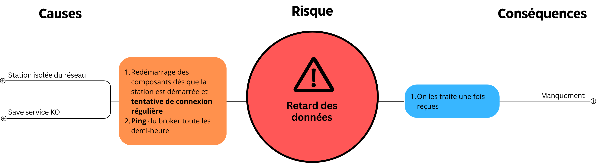
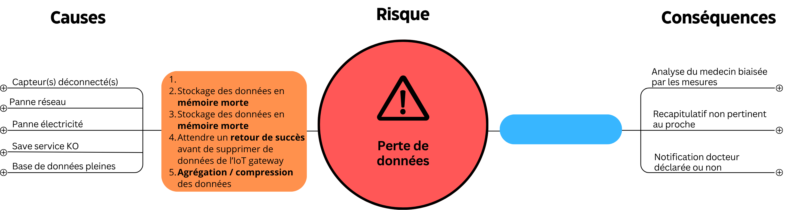
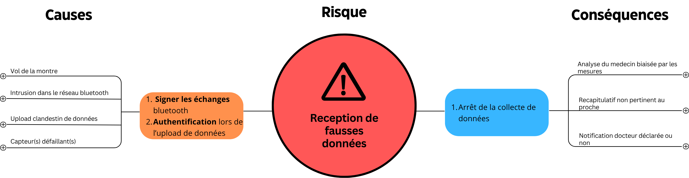
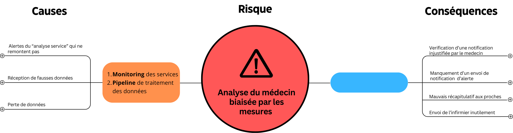
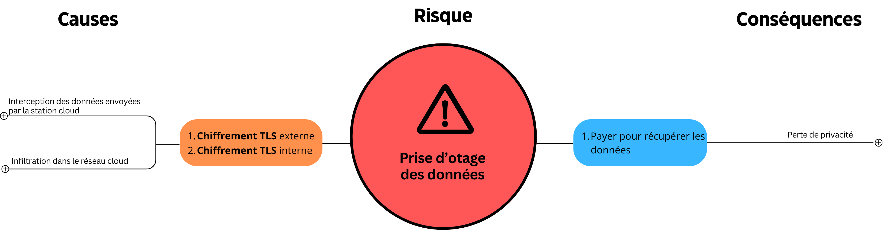
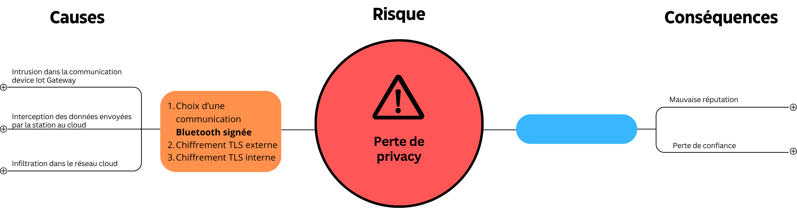

# Analyse des risques
## Matrice des risques
La matrice des risques suivante a été utilisée pour évaluer et classer les risques associés au projet.

## Bowtie des risques majeurs
### Retard de données

### Perte de données

### Réception de fausses données

### Analyse biaisée

### Prise d'hôtage de données

### Perte de confidentialité

