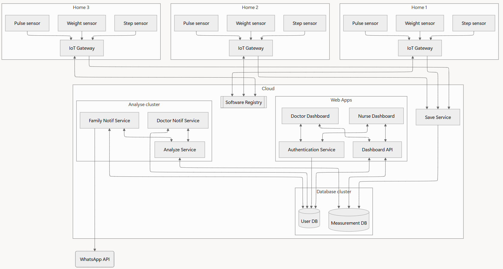
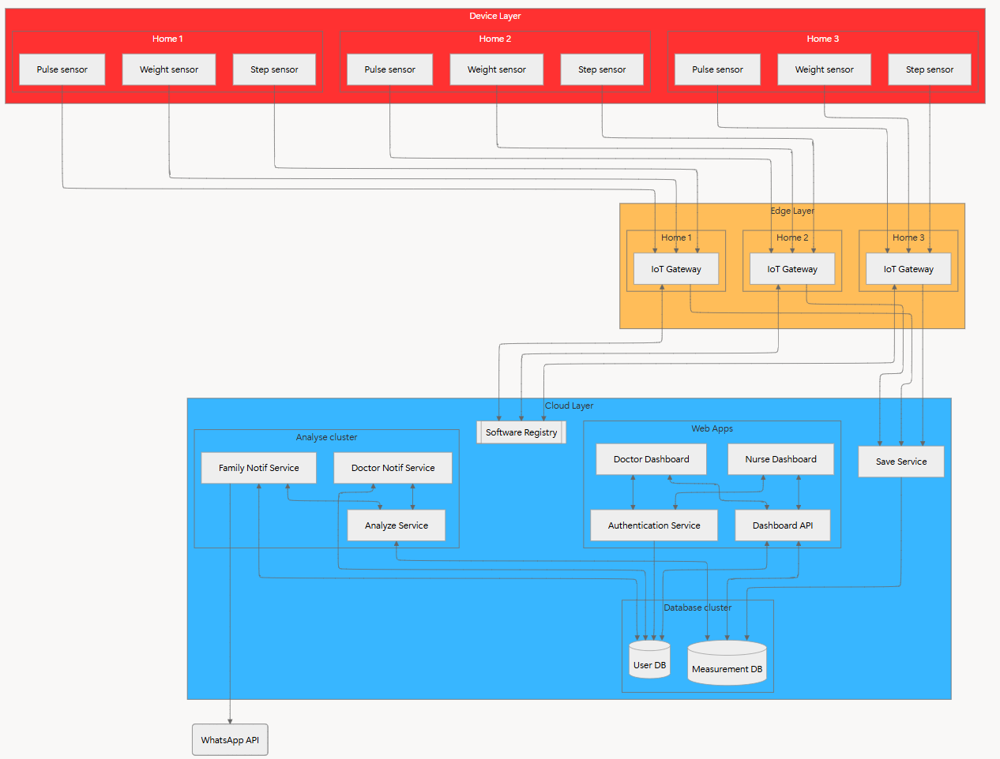
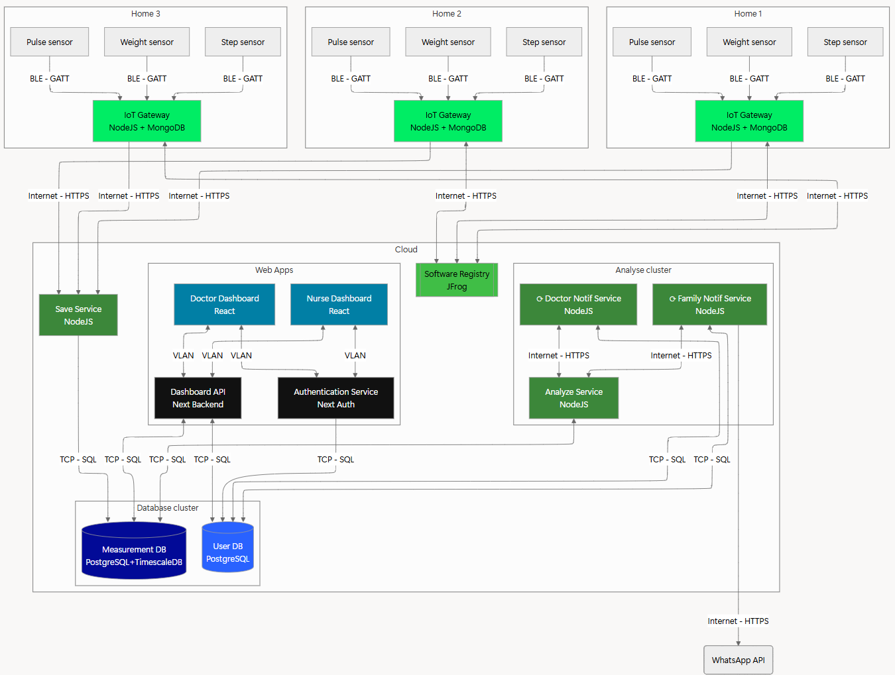

# Architecture
## Les composants

**Légende :**
- →  : Échange de données
- ☐ : Composant logiciel
- ⛁ : Base de données

## Digramme en couches IoT

**Légende :**
- →  : Échange de données
- ☐ : Composant logiciel
- ⛁ : Base de données

## Diagramme technique  softwares échanges réseau
Le diagramme ci-dessous illustre la technologie utilisée pour chaque composant logiciel et les type d'échanges réseau entre eux.

**Légende :**
- →  : Échange de données
- ☐ : Composant logiciel
- ⛁ : Base de données

## Description des composants
### Appareils connectés
Toutes informations à propos des appareils connectés sont [ici](../devices/mock-watch/README.md).

### Station IoT Gateway
L'ensemble des informations concernant les composants logiciels de la station IoT Gateway sont disponibles [ici](../box/README.md#composants-logiciels).

### Cloud Backend
Les informations concernant les composants logiciels du Cloud Backend sont recensées [ici](./CLOUD.md#composants-logiciels).