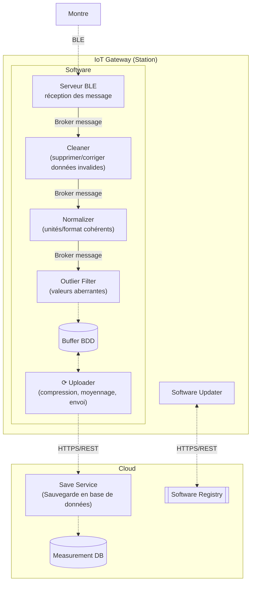

# projet-IAL

## Pipeline

### Architecture de la pipeline



[En savoir plus](https://www.notion.so/Diagramme-composants-Data-Pipeline-280b70b82f6b80f48968cb4c271ec0b5)

### Données échangées

#### Boitier (box) -> Cleaner

Queue : MEASUREMENT.to_clean

```json
{
    "boxId": string,
    "dataList": [
        {
            "type" : string
            "value" : number,
            "unit" : string,
            "timestamp": string
        },
        ...
    ]
}
```

#### Cleaner -> Outlier filter

Queue : MEASUREMENT.to_outlierfilter

```json
{
    "boxId": string,
    "dataList": [
        {
            "type" : string
            "value" : number,
            "unit" : string,
            "timestamp": string
        },
        ...
    ]
}
```

#### Outlier filter -> Normalizer

Queue : MEASUREMENT.to_normalize

```json
{
    "boxId": string,
    "dataList": [
        {
            "type" : string
            "value" : number,
            "unit" : string,
            "timestamp": string
        },
        ...
    ]
}
```

#### Normalizer -> Analyzer

Queue : MEASUREMENT.to_analyze

```json
{
    "boxId": string,
    "dataList": [
        {
            "type" : string
            "value" : number,
            "unit" : string,
            "timestamp": string
        },
        ...
    ]
}
```

#### Normalizer -> Splitter

Queue : MEASUREMENT.to_split

```json
{
    "boxId": string,
    "dataList": [
        {
            "type" : string
            "value" : number,
            "unit" : string,
            "timestamp": string
        },
        ...
    ]
}
```

#### Splitter -> Save Service

Queue : MEASUREMENT.to_save

```json
{
    "boxId" : string,
    "type" : string,
    "value" : number,
    "unit" : string,
    "timestamp": string,
}
```

#### Analyzer -> Save Service

Queue : MEASUREMENT.to_save

```json
{
    "boxId" : string,
    "type" : string,
    "fromTimestamp": string,
    "toTimestamp": string,
}
```
